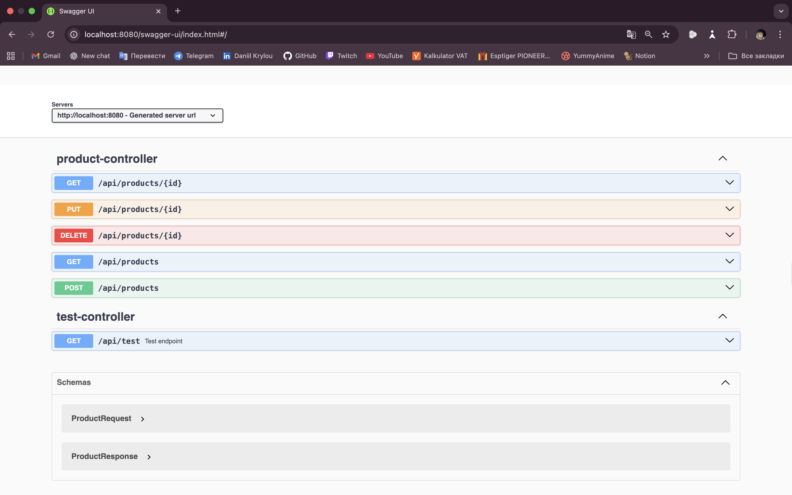
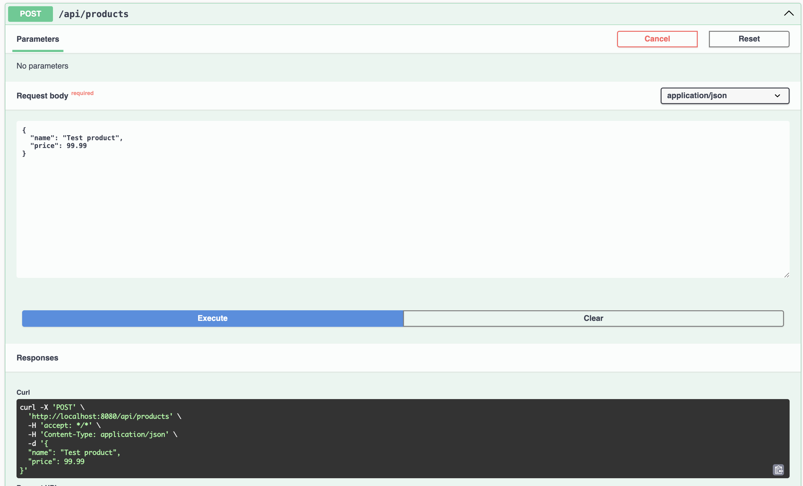
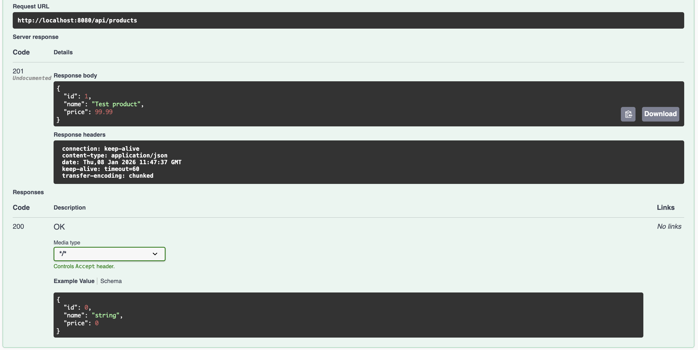
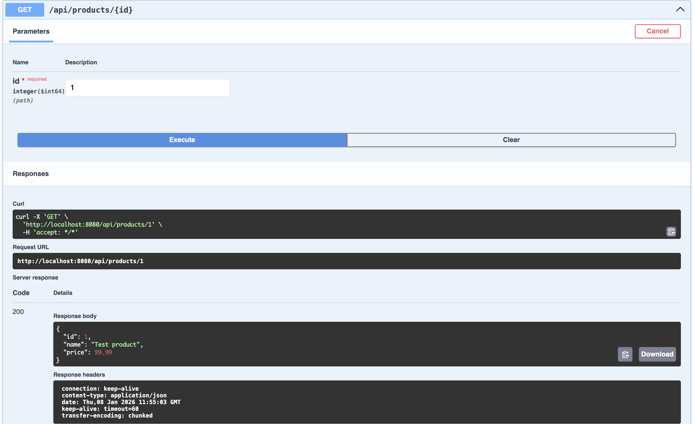
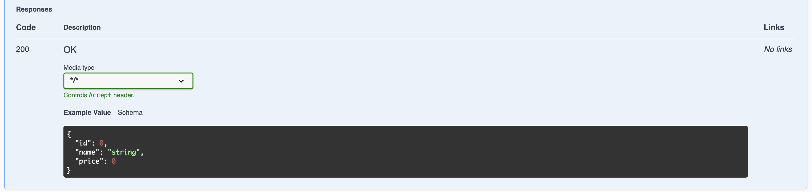
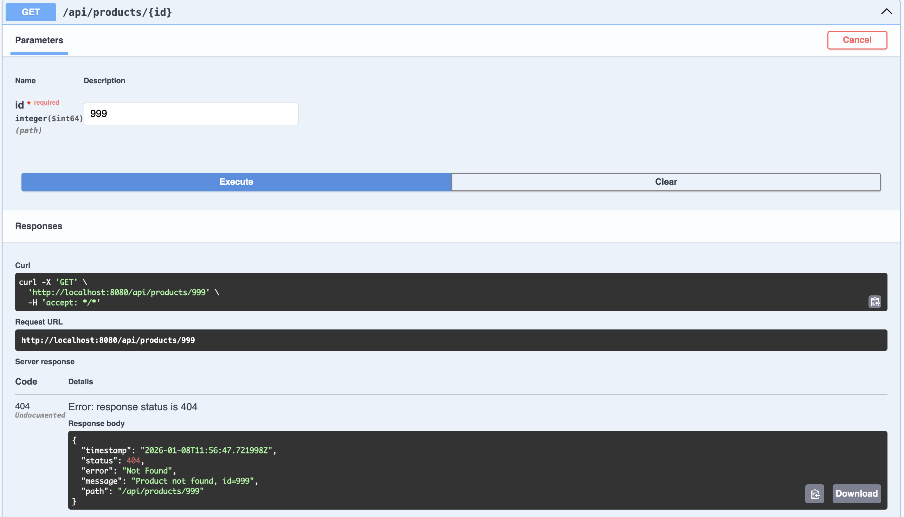
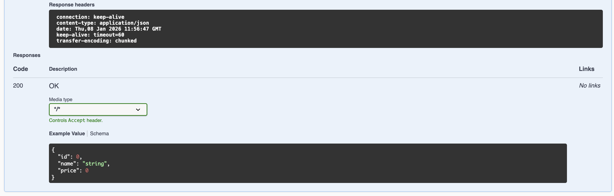

# Task2Project 06.16.24

Spring Boot REST API with Swagger (OpenAPI).

## Swagger UI
http://localhost:8080/swagger-ui/index.html

---

## Use cases

### POST /api/products
Create product.

---

### GET /api/products/{id}
Get product by ID.

---

### GET /api/products/{id} – Not Found
Product not found case.

